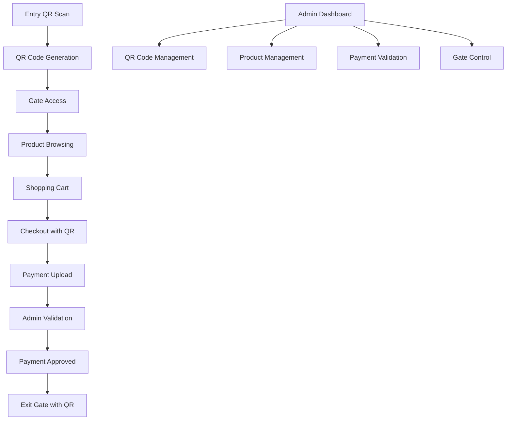

# Sistem POS dengan Gate Access Control

## 1. Product Overview
Sistem Point of Sale (POS) terintegrasi dengan kontrol akses gate yang memungkinkan tracking keluar masuk pengunjung melalui QR code scanning dan RFID access control. Sistem ini menggabungkan fungsi retail management dengan security access control untuk menciptakan pengalaman berbelanja yang aman dan termonitor.

Sistem ini memecahkan masalah keamanan dan tracking pengunjung di retail store sambil menyediakan platform penjualan yang lengkap dengan validasi pembayaran manual.

## 2. Core Features

### 2.1 User Roles
| Role | Registration Method | Core Permissions |
|------|---------------------|------------------|
| Admin | Default admin account | Kelola semua sistem, validasi pembayaran, monitoring |
| Customer | QR code scanning saat masuk | Belanja produk, checkout, akses gate dengan QR code |
| Gate System | API integration | Validasi QR code, buka/tutup gate berdasarkan database |

### 2.2 Feature Module
Sistem POS kami terdiri dari halaman-halaman utama berikut:
1. **Dashboard Admin**: monitoring real-time, statistik pengunjung, status gate system
2. **Entry Tracking**: scan QR code untuk registrasi masuk pengunjung
3. **QR Code Management**: kelola QR code untuk akses gate dan identifikasi
4. **Product Management**: kelola inventory, harga, stok produk
5. **Shopping Cart**: keranjang belanja untuk customer
6. **Checkout**: proses pembayaran manual bank transfer
7. **Payment Validation**: validasi pembayaran oleh admin
8. **Gate Control**: interface untuk sistem gate QR code

### 2.3 Page Details
| Page Name | Module Name | Feature description |
|-----------|-------------|---------------------|
| Dashboard Admin | Real-time Monitoring | Tampilkan jumlah pengunjung aktif, status gate, revenue harian |
| Dashboard Admin | Quick Actions | Tombol cepat untuk validasi pembayaran, emergency gate control |
| Entry Tracking | QR Scanner | Scan QR code pengunjung untuk registrasi masuk, simpan timestamp |
| Entry Tracking | Visitor Log | Daftar pengunjung yang masuk dengan waktu dan status |
| QR Code Management | QR Code Registration | Generate QR code unik untuk customer, link dengan data pengunjung |
| QR Code Management | QR Code Database | Kelola daftar QR code aktif, nonaktifkan QR code, edit permissions |
| Product Management | Inventory Control | Tambah, edit, hapus produk dengan foto, harga, stok |
| Product Management | Category Management | Kelola kategori produk, filter dan pencarian |
| Shopping Cart | Product Selection | Browse produk, tambah ke keranjang, ubah quantity |
| Shopping Cart | Cart Management | Review keranjang, hapus item, hitung total |
| Checkout | Payment Process | Input data pembayaran bank transfer, upload bukti transfer |
| Checkout | Order Summary | Ringkasan pesanan, detail pembayaran, status pending |
| Payment Validation | Payment Review | Admin review bukti pembayaran, approve/reject transaksi |
| Payment Validation | Transaction History | Riwayat semua transaksi dengan status pembayaran |
| Gate Control | QR Code Verification | API endpoint untuk verifikasi QR code dari gate system |
| Gate Control | Access Log | Log semua aktivitas buka/tutup gate dengan timestamp |

## 3. Core Process

**Customer Flow:**
1. Customer datang ke toko dan scan QR code di entry point untuk registrasi masuk
2. System generate QR code unik untuk customer yang sudah teregistrasi
3. Customer menggunakan QR code untuk akses gate masuk (gate system verifikasi ke database)
4. Customer browse produk dan menambahkan ke shopping cart
5. Customer melakukan checkout menggunakan QR code untuk identifikasi dan upload bukti bank transfer
6. Admin memvalidasi pembayaran dan approve transaksi
7. Customer keluar menggunakan QR code yang sama di gate exit

**Admin Flow:**
1. Admin monitoring dashboard untuk melihat aktivitas real-time
2. Admin mengelola QR code registration dan permissions untuk customer
3. Admin mengelola inventory dan harga produk
4. Admin memvalidasi pembayaran customer dan approve/reject
5. Admin monitoring gate access log dan visitor tracking

## 4. User Interface Design

### 4.1 Design Style
- **Primary Colors**: #2563eb (blue), #059669 (green untuk approved)
- **Secondary Colors**: #dc2626 (red untuk rejected), #f59e0b (amber untuk pending)
- **Button Style**: Rounded corners dengan shadow, 3D effect untuk CTA buttons
- **Font**: Inter atau Roboto, ukuran 14px untuk body text, 18px untuk headers
- **Layout Style**: Card-based design dengan sidebar navigation, responsive grid
- **Icons**: Feather icons atau Heroicons untuk konsistensi, emoji 📱 untuk QR code, 🎫 untuk access control

### 4.2 Page Design Overview
| Page Name | Module Name | UI Elements |
|-----------|-------------|-------------|
| Dashboard Admin | Real-time Stats | Card layout dengan angka besar, warna hijau/merah untuk status, chart untuk trend |
| Entry Tracking | QR Scanner | Fullscreen camera view, overlay frame untuk QR, success animation |
| QR Code Management | QR Code List | Table dengan search filter, status badges, action buttons |
| Product Management | Product Grid | Card grid layout dengan foto produk, price tags, stock indicators |
| Shopping Cart | Cart Items | List layout dengan quantity controls, delete buttons, sticky total |
| Checkout | Payment Form | Step-by-step wizard, file upload area, order summary sidebar |
| Payment Validation | Payment Queue | Queue-style layout dengan approve/reject buttons, image preview |
| Gate Control | Access Monitor | Real-time log dengan timestamp, status indicators, emergency controls |

### 4.3 Responsiveness
Sistem dirancang mobile-first dengan adaptasi desktop. Touch interaction dioptimalkan untuk tablet yang digunakan admin, dengan gesture swipe untuk navigasi dan large touch targets untuk buttons.