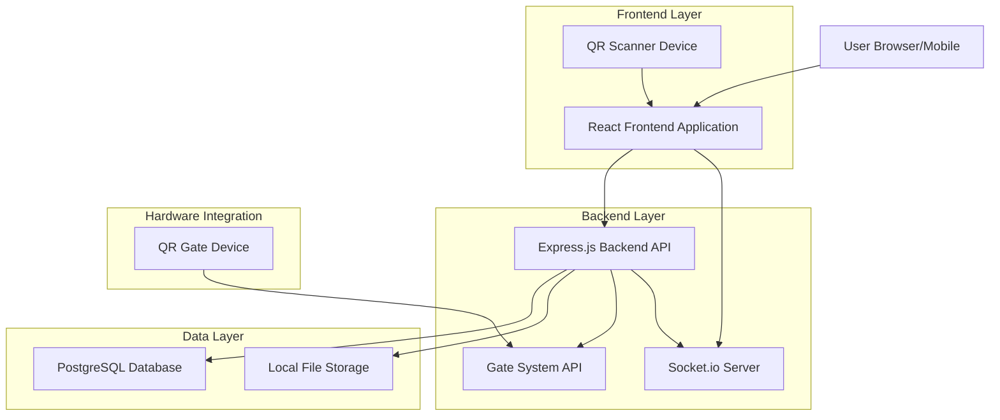
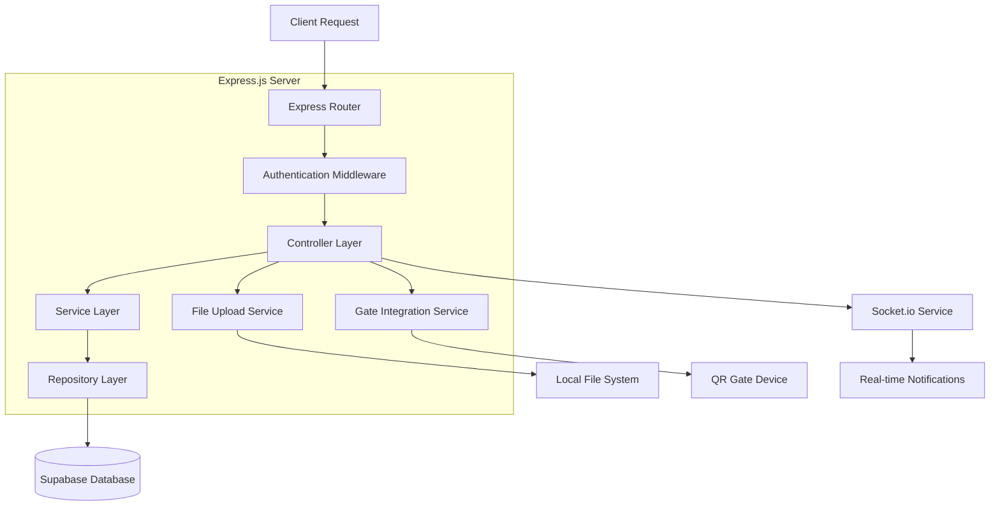
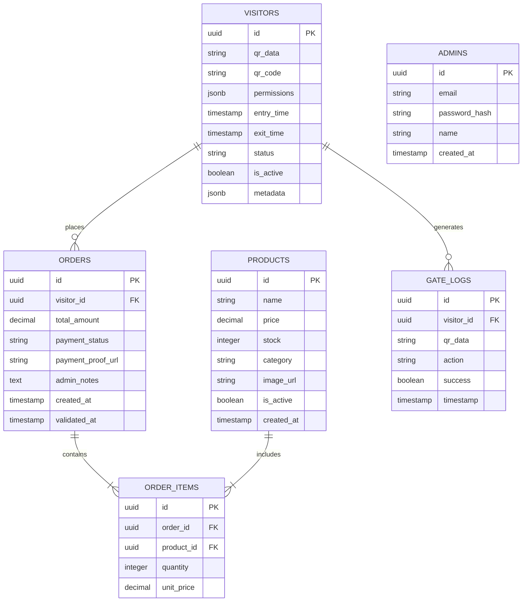

# Technical Architecture Document - Sistem POS dengan Gate Access Control

## 1. Architecture Design



## 2. Technology Description

* **Frontend**: React\@18 + TypeScript + Tailwind CSS + Vite + Socket.io-client

* **Backend**: Express.js\@4 + TypeScript + Node.js + Socket.io

* **Database**: PostgreSQL\@15 + pg (node-postgres)

* **File Storage**: Local file system dengan multer

* **Authentication**: JWT + bcrypt untuk password hashing

* **Real-time**: Socket.io untuk monitoring dan notifications

* **QR Code**: react-qr-scanner, qrcode libraries

* **Environment**: dotenv untuk configuration management

## 3. Route Definitions

| Route            | Purpose                                     |
| ---------------- | ------------------------------------------- |
| /                | Landing page dengan login                   |
| /admin/dashboard | Dashboard admin dengan monitoring real-time |
| /admin/qrcodes   | Manajemen QR codes                          |
| /admin/settings  | Konfigurasi sistem dan database             |
| /admin/products  | Manajemen inventory produk                  |
| /admin/payments  | Validasi pembayaran customer                |
| /admin/visitors  | Log pengunjung dan entry tracking           |
| /entry           | QR code scanning untuk registrasi masuk     |
| /shop            | Halaman belanja untuk customer              |
| /cart            | Shopping cart customer                      |
| /checkout        | Proses checkout dan upload pembayaran       |
| /gate/status     | Status gate untuk customer                  |

## 4. API Definitions

### 4.1 Core API

**Authentication**

```
POST /api/auth/login
```

Request:

| Param Name | Param Type | isRequired | Description                 |
| ---------- | ---------- | ---------- | --------------------------- |
| email      | string     | true       | Email admin                 |
| password   | string     | true       | Password admin (plain text) |

Response:

| Param Name | Param Type | Description                |
| ---------- | ---------- | -------------------------- |
| success    | boolean    | Status login               |
| token      | string     | JWT token dengan expiry    |
| user       | object     | Data user (tanpa password) |

```
POST /api/auth/register
```

Request:

| Param Name | Param Type | isRequired | Description                           |
| ---------- | ---------- | ---------- | ------------------------------------- |
| email      | string     | true       | Email admin baru                      |
| password   | string     | true       | Password (akan di-hash dengan bcrypt) |
| name       | string     | true       | Nama admin                            |

```
POST /api/auth/verify
```

Headers:

| Header Name   | Header Type | isRequired | Description         |
| ------------- | ----------- | ---------- | ------------------- |
| Authorization | string      | true       | Bearer {jwt\_token} |

Response:

| Param Name | Param Type | Description          |
| ---------- | ---------- | -------------------- |
| valid      | boolean    | Status token valid   |
| user       | object     | Data user jika valid |

**Entry Tracking**

```
POST /api/entry/scan
```

Request:

| Param Name | Param Type | isRequired | Description       |
| ---------- | ---------- | ---------- | ----------------- |
| qr\_data   | string     | true       | Data dari QR code |
| timestamp  | string     | true       | Waktu scan        |

Response:

| Param Name  | Param Type | Description       |
| ----------- | ---------- | ----------------- |
| success     | boolean    | Status registrasi |
| visitor\_id | string     | ID pengunjung     |
| entry\_time | string     | Waktu masuk       |

**QR Code Management**

```
POST /api/qrcode/generate
```

Request:

| Param Name  | Param Type | isRequired | Description    |
| ----------- | ---------- | ---------- | -------------- |
| visitor\_id | string     | true       | ID pengunjung  |
| permissions | array      | true       | Hak akses gate |

Response:

| Param Name | Param Type | Description                  |
| ---------- | ---------- | ---------------------------- |
| qr\_code   | string     | QR code unik untuk customer  |
| qr\_data   | string     | Data yang di-encode dalam QR |

```
GET /api/qrcode/verify/{qr_data}
```

Response:

| Param Name  | Param Type | Description          |
| ----------- | ---------- | -------------------- |
| valid       | boolean    | Status QR code valid |
| visitor\_id | string     | ID pengunjung        |
| permissions | array      | Hak akses            |

**Product Management**

```
GET /api/products
```

Response:

| Param Name | Param Type | Description   |
| ---------- | ---------- | ------------- |
| products   | array      | Daftar produk |
| total      | number     | Total produk  |

```
POST /api/products
```

Request:

| Param Name | Param Type | isRequired | Description     |
| ---------- | ---------- | ---------- | --------------- |
| name       | string     | true       | Nama produk     |
| price      | number     | true       | Harga produk    |
| stock      | number     | true       | Stok tersedia   |
| category   | string     | true       | Kategori produk |
| image      | file       | false      | Foto produk     |

**Shopping & Checkout**

```
POST /api/orders
```

Request:

| Param Name     | Param Type | isRequired | Description      |
| -------------- | ---------- | ---------- | ---------------- |
| visitor\_id    | string     | true       | ID pengunjung    |
| items          | array      | true       | Daftar produk    |
| total\_amount  | number     | true       | Total pembayaran |
| payment\_proof | file       | true       | Bukti transfer   |

**Payment Validation**

```
PUT /api/orders/{order_id}/validate
```

Request:

| Param Name   | Param Type | isRequired | Description       |
| ------------ | ---------- | ---------- | ----------------- |
| status       | string     | true       | approved/rejected |
| admin\_notes | string     | false      | Catatan admin     |

**File Upload**

```
POST /api/upload/payment-proof
```

Request (multipart/form-data):

| Param Name | Param Type | isRequired | Description                      |
| ---------- | ---------- | ---------- | -------------------------------- |
| file       | file       | true       | Bukti pembayaran (jpg, png, pdf) |
| order\_id  | string     | true       | ID order terkait                 |

Response:

| Param Name | Param Type | Description              |
| ---------- | ---------- | ------------------------ |
| success    | boolean    | Status upload            |
| file\_path | string     | Path file yang tersimpan |
| file\_url  | string     | URL untuk akses file     |

### 4.2 Socket.io Real-time Events

**Client Events (dari frontend ke server)**

```javascript
// Join admin room untuk monitoring
socket.emit('join-admin-room', { admin_id: 'uuid' });

// Join visitor room untuk notifications
socket.emit('join-visitor-room', { visitor_id: 'uuid' });

// Request real-time stats
socket.emit('request-stats');
```

**Server Events (dari server ke frontend)**

```javascript
// Visitor baru masuk
socket.emit('new-visitor', {
  visitor_id: 'uuid',
  entry_time: '2024-01-01T10:00:00Z',
  qr_data: 'visitor_qr_code'
});

// Order baru dibuat
socket.emit('new-order', {
  order_id: 'uuid',
  visitor_id: 'uuid',
  total_amount: 150000,
  status: 'pending'
});

// Payment validation update
socket.emit('payment-validated', {
  order_id: 'uuid',
  status: 'approved',
  admin_notes: 'Payment verified'
});

// Real-time statistics
socket.emit('stats-update', {
  active_visitors: 25,
  pending_payments: 3,
  daily_revenue: 2500000,
  gate_status: 'online'
});

// Gate access log
socket.emit('gate-access', {
  visitor_id: 'uuid',
  action: 'entry',
  success: true,
  timestamp: '2024-01-01T10:00:00Z'
});
```

## 5. Server Architecture Diagram



## 6. Data Model

### 6.1 Data Model Definition



### 6.2 Data Definition Language

**Visitors Table**

```sql
-- Create visitors table
CREATE TABLE visitors (
    id UUID PRIMARY KEY DEFAULT gen_random_uuid(),
    qr_data TEXT UNIQUE NOT NULL,
    qr_code TEXT UNIQUE NOT NULL,
    permissions JSONB DEFAULT '["gate_entry", "gate_exit"]',
    entry_time TIMESTAMP WITH TIME ZONE DEFAULT NOW(),
    exit_time TIMESTAMP WITH TIME ZONE,
    status VARCHAR(20) DEFAULT 'active' CHECK (status IN ('active', 'exited')),
    is_active BOOLEAN DEFAULT true,
    metadata JSONB DEFAULT '{}',
    created_at TIMESTAMP WITH TIME ZONE DEFAULT NOW()
);

-- Create index
CREATE INDEX idx_visitors_qr_data ON visitors(qr_data);
CREATE INDEX idx_visitors_qr_code ON visitors(qr_code);
CREATE INDEX idx_visitors_entry_time ON visitors(entry_time DESC);
CREATE INDEX idx_visitors_status ON visitors(status);
CREATE INDEX idx_visitors_active ON visitors(is_active);
```

**Products Table**

```sql
-- Create products table
CREATE TABLE products (
    id UUID PRIMARY KEY DEFAULT gen_random_uuid(),
    name VARCHAR(255) NOT NULL,
    price DECIMAL(10,2) NOT NULL,
    stock INTEGER DEFAULT 0,
    category VARCHAR(100) NOT NULL,
    image_url TEXT,
    is_active BOOLEAN DEFAULT true,
    created_at TIMESTAMP WITH TIME ZONE DEFAULT NOW(),
    updated_at TIMESTAMP WITH TIME ZONE DEFAULT NOW()
);

-- Create index
CREATE INDEX idx_products_category ON products(category);
CREATE INDEX idx_products_active ON products(is_active);
CREATE INDEX idx_products_stock ON products(stock);
```

**Orders Table**

```sql
-- Create orders table
CREATE TABLE orders (
    id UUID PRIMARY KEY DEFAULT gen_random_uuid(),
    visitor_id UUID REFERENCES visitors(id) ON DELETE CASCADE,
    total_amount DECIMAL(10,2) NOT NULL,
    payment_status VARCHAR(20) DEFAULT 'pending' CHECK (payment_status IN ('pending', 'approved', 'rejected')),
    payment_proof_url TEXT,
    admin_notes TEXT,
    created_at TIMESTAMP WITH TIME ZONE DEFAULT NOW(),
    validated_at TIMESTAMP WITH TIME ZONE
);

-- Create index
CREATE INDEX idx_orders_visitor ON orders(visitor_id);
CREATE INDEX idx_orders_status ON orders(payment_status);
CREATE INDEX idx_orders_created ON orders(created_at DESC);
```

**Order Items Table**

```sql
-- Create order_items table
CREATE TABLE order_items (
    id UUID PRIMARY KEY DEFAULT gen_random_uuid(),
    order_id UUID REFERENCES orders(id) ON DELETE CASCADE,
    product_id UUID REFERENCES products(id) ON DELETE CASCADE,
    quantity INTEGER NOT NULL,
    unit_price DECIMAL(10,2) NOT NULL
);

-- Create index
CREATE INDEX idx_order_items_order ON order_items(order_id);
CREATE INDEX idx_order_items_product ON order_items(product_id);
```

**Gate Logs Table**

```sql
-- Create gate_logs table
CREATE TABLE gate_logs (
    id UUID PRIMARY KEY DEFAULT gen_random_uuid(),
    visitor_id UUID REFERENCES visitors(id) ON DELETE CASCADE,
    qr_data TEXT NOT NULL,
    action VARCHAR(20) NOT NULL CHECK (action IN ('entry', 'exit')),
    success BOOLEAN NOT NULL,
    timestamp TIMESTAMP WITH TIME ZONE DEFAULT NOW()
);

-- Create index
CREATE INDEX idx_gate_logs_visitor ON gate_logs(visitor_id);
CREATE INDEX idx_gate_logs_qr_data ON gate_logs(qr_data);
CREATE INDEX idx_gate_logs_timestamp ON gate_logs(timestamp DESC);
```

**Admins Table**

```sql
-- Create admins table
CREATE TABLE admins (
    id UUID PRIMARY KEY DEFAULT gen_random_uuid(),
    email VARCHAR(255) UNIQUE NOT NULL,
    password_hash VARCHAR(255) NOT NULL,
    name VARCHAR(100) NOT NULL,
    created_at TIMESTAMP WITH TIME ZONE DEFAULT NOW()
);

-- Create index
CREATE INDEX idx_admins_email ON admins(email);

-- Insert default admin (password: admin123)
INSERT INTO admins (email, password_hash, name) VALUES 
('admin@pos.com', '$2b$10$rQZ8kJZjZjZjZjZjZjZjZu', 'System Administrator');

-- Create triggers for updated_at
CREATE OR REPLACE FUNCTION update_updated_at_column()
RETURNS TRIGGER AS $$
BEGIN
    NEW.updated_at = NOW();
    RETURN NEW;
END;
$$ language 'plpgsql';

CREATE TRIGGER update_products_updated_at BEFORE UPDATE ON products
    FOR EACH ROW EXECUTE FUNCTION update_updated_at_column();
```

**Database Configuration**

```sql
-- Create database
CREATE DATABASE sunmi_pos_system;

-- Create application user
CREATE USER pos_app WITH PASSWORD 'Sinau314';
GRANT ALL PRIVILEGES ON DATABASE sunmi_pos_system TO pos_app;

-- Connect to database and grant table permissions
\c sunmi_pos_system;
GRANT ALL PRIVILEGES ON ALL TABLES IN SCHEMA public TO pos_app;
GRANT ALL PRIVILEGES ON ALL SEQUENCES IN SCHEMA public TO pos_app;
```

**Environment Variables (.env)**

```env
# Database Configuration
DB_HOST=localhost
DB_PORT=5432
DB_NAME=sunmi_pos_system
DB_USER=pos_app
DB_PASSWORD=Sinau314

# JWT Configuration
JWT_SECRET=your_jwt_secret_key
JWT_EXPIRES_IN=24h

# File Upload Configuration
UPLOAD_DIR=./uploads
MAX_FILE_SIZE=5242880

# Server Configuration
PORT=3000
NODE_ENV=development

# Socket.io Configuration
SOCKET_CORS_ORIGIN=http://localhost:5173
```

